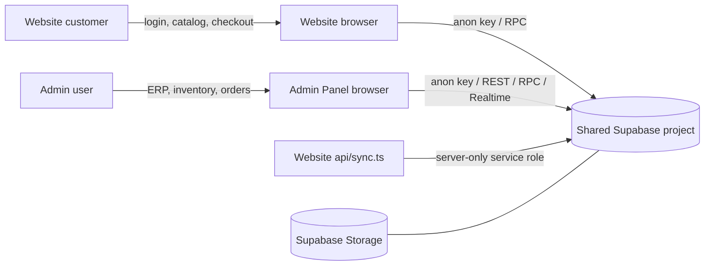
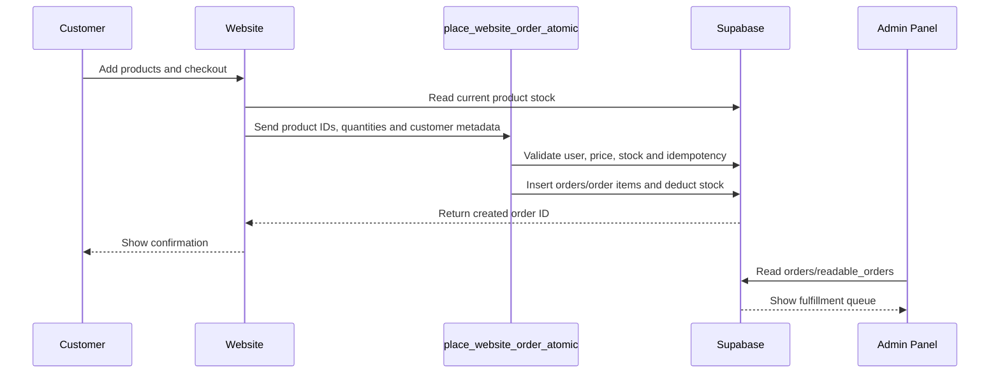

# NM Mart Backend Project Map

This document is the handoff map for the NM Mart Admin Panel and Website. Both applications use the same Supabase project as the shared backend source of truth.

## 1. Projects and Runtime

### Admin Panel

- Location: `D:\NM MART DATA\admin panel host`
- Stack: React 18, Vite, JavaScript
- Browser entry: `src/main.jsx`
- Main orchestration: `src/App.jsx`
- Backend boundary: Supabase REST, Auth, Realtime, Storage and RPCs
- Browser credential: Supabase anon/public key only

### Website

- Location: `D:\NM MART DATA\NM-MART-PROJECT SITE\nm-mart`
- Stack: React 18, Vite, TypeScript
- Browser entry: `src/main.tsx`
- Route tree: `src/App.tsx`
- Server/API boundary: `api/sync.ts`
- Browser credential: Supabase anon/public key only
- Server-only credential: `SUPABASE_SERVICE_ROLE_KEY` in `api/sync.ts` only



## 2. Shared Supabase Project

- Project ref: `mggkadgemqcyybsplkqc`
- Project URL: `https://mggkadgemqcyybsplkqc.supabase.co`
- Current tenant/company convention: `tenant_id = 1`, `company_code = 'NMM001'`
- Runtime clients in both applications point to this project.
- Supabase CLI project config: `../NM-MART-PROJECT SITE/nm-mart/supabase/config.toml`
- Live verification completed on 2026-09-20:
  - `products` table visible rows: 524
  - `orders` table visible rows: 0 at verification time
  - `categories` table visible rows: 23
  - `brands` table visible rows: 19
  - Sample product tenant: `1 / NMM001`

### Applied migrations

The following website migrations are applied to the shared live project:

- `supabase/migrations/20260920000000_add_cart_items.sql`
- `supabase/migrations/20260920000001_fix_order_rpc_text_types.sql`

The second migration patches the existing website order RPC implementation and backfills tenant/company values for matching legacy `NM-*` orders. It does not replace the whole database schema.

## 3. Environment and Supabase Clients

### Admin client

File: `src/supabase.js`

Important exports:

- `supabase`
- `getSupabaseConfig`
- `getSupabaseDiagnostics`

Environment variables:

- `VITE_SUPABASE_URL`
- `VITE_SUPABASE_ANON_KEY`
- `VITE_USE_MOCK`
- `VITE_SUPABASE_REALTIME_ENABLED`
- `VITE_SUPABASE_TIMEOUT_MS`
- `VITE_LOCAL_POS_TEST_AUTH`
- `VITE_LOCAL_POS_TEST_READS`
- `VITE_STORE_BASE_URL`

### Website client

File: `../NM-MART-PROJECT SITE/nm-mart/src/lib/supabase/client.ts`

Important exports:

- `resolveSupabaseConfig`
- `supabaseConfig`
- `supabase`

Browser environment variables:

- `VITE_SUPABASE_URL` or `NEXT_PUBLIC_SUPABASE_URL`
- `VITE_SUPABASE_ANON_KEY` or `NEXT_PUBLIC_SUPABASE_ANON_KEY`

Server-only variables for `api/sync.ts`:

- `SUPABASE_URL`
- `SUPABASE_SERVICE_ROLE_KEY`
- `SYNC_TOKEN`
- `ALLOWED_ORIGIN`

Never put `SUPABASE_SERVICE_ROLE_KEY` or `SYNC_TOKEN` in a `VITE_*` or `NEXT_PUBLIC_*` variable.

## 4. Authentication and Authorization

### Admin login

Primary file: `src/context/AuthContext.jsx`

Flow:

1. Restore valid local auth state, otherwise call `supabase.auth.getSession()`.
2. Listen to `supabase.auth.onAuthStateChange`.
3. Login uses `supabase.auth.signInWithPassword`.
4. Load the matching `admin_users` record.
5. Resolve the company using `companies.company_code`.
6. Reject disabled users or suspended companies.
7. Store a reduced user/session/company snapshot locally.
8. `ProtectedRoute` and role checks protect the application views.

Related files:

- `src/context/AuthContext.jsx`
- `src/components/ProtectedRoute.jsx`
- `src/utils/securityHelper.js`
- `src/main.jsx`

### Website customer login

Related files:

- `../NM-MART-PROJECT SITE/nm-mart/src/pages/Login.tsx`
- `../NM-MART-PROJECT SITE/nm-mart/src/App.tsx`
- `../NM-MART-PROJECT SITE/nm-mart/src/lib/supabase/client.ts`

Supported flows include email/password, Google OAuth, password recovery and password reset. Checkout and customer order/account screens require an active Supabase session.

Website admin access is controlled by `admin_users` through `src/lib/adminAccess.ts`; frontend checks do not replace database RLS.

## 5. Main Source Ownership

### Admin Panel

- `src/App.jsx`: application shell, initial data loading, image upload wiring
- `src/main.jsx`: providers and routes
- `src/context/`: auth, global data and POS state
- `src/pages/`: dashboard, POS, inventory, orders, analytics and settings
- `src/components/`: reusable dialogs, panels, receipts and payment UI
- `src/features/pos/`: modular POS checkout and persistence
- `src/dbSchema.js`: table/column mapping and readable view names
- `src/dbSync.js`: generic Supabase adapter for fetch, write, delete, RPC and Realtime
- `src/erpController.js`: ERP action dispatch and frontend authorization
- `src/services/`: auth and ERP service wrappers
- `scripts/`: schema fetch/validation/synchronization utilities

### Website

- `src/App.tsx`: route tree and customer/admin guards
- `src/pages/`: storefront, checkout, account, orders and website admin
- `src/components/shop/`: storefront UI
- `src/hooks/`: products, cart, wishlist and addresses
- `src/lib/supabase/`: client, schema, orders, inventory, profiles, wallet and images
- `src/lib/orderPayload.ts`: checkout validation and minimal order payload
- `api/sync.ts`: server-side product sync endpoint
- `supabase/migrations/`: database migrations
- `supabase/docs/`: database contract documentation

## 6. Tables and Views

### Tables used by Admin

The canonical mapping is in `src/dbSchema.js`.

Core business tables:

- `companies`
- `admin_users`
- `users`
- `profiles`
- `products`
- `categories`
- `subcategories`
- `brands`
- `orders`
- `order_items`
- `payment_transactions`
- `purchases`
- `purchase_items`
- `inventory_logs`
- `stock_alerts`
- `notifications`
- `expenses`
- `expense_categories`
- `addresses`
- `pincode_master`
- `banners`
- `coupons`
- `offers_master`
- `home_config`
- `app_config`
- `customer_loyalty`
- `loyalty_transactions`
- `loyalty_tiers`
- `cart`
- `wishlist`
- `support_tickets`
- `system_logs`

Readable objects preferred by the admin loader:

- `readable_products`
- `readable_categories`
- `readable_brands`
- `readable_banners`
- `readable_coupons`
- `readable_orders`
- `readable_users`

`dbSync.fetch()` applies tenant/company filters and falls back to base tables when a readable view is unavailable.

### Tables used by Website

The constants are in `../NM-MART-PROJECT SITE/nm-mart/src/lib/supabase/schema.ts`.

- `products`
- `orders`
- `profiles`
- `categories`
- `banners`
- `wishlist_items`
- `store_assets`
- `customer_addresses`
- `wallets`
- `wallet_transactions`
- `cart_items`

## 7. Website Order Flow



Main files:

- `../NM-MART-PROJECT SITE/nm-mart/src/pages/Checkout.tsx`
- `../NM-MART-PROJECT SITE/nm-mart/src/lib/orderPayload.ts`
- `../NM-MART-PROJECT SITE/nm-mart/src/lib/supabase/orders.ts`
- `../NM-MART-PROJECT SITE/nm-mart/src/pages/Orders.tsx`
- `../NM-MART-PROJECT SITE/nm-mart/src/pages/OrderDetails.tsx`

Checkout behavior:

1. Customer must have an active session.
2. Website validates name, address, phone, pincode and payment method.
3. Website performs a stock preflight query.
4. `buildServerOrderPayload()` sends product IDs and quantities, not trusted browser totals.
5. `place_website_order_atomic` is responsible for authoritative pricing, stock and order creation.
6. Cart is cleared after the RPC returns an order ID.

The website currently sends `cod` from the checkout UI, although validation accepts additional payment method values.

## 8. Admin Order and Inventory Flows

### Online orders

Main files:

- `src/pages/Orders/OnlineOrderView.jsx`
- `src/pages/Orders/OrdersView.jsx`
- `src/dbSync.js`
- `src/erpController.js`

Website orders are read from `orders` or `readable_orders`. The fulfillment queue accepts `order_status` and legacy `status` values. Admin status changes write `order_status` and mirror the value to `status` so the website sees the same state.

Typical fulfillment states:

- `pending`
- `confirmed`
- `packed`
- `out_for_delivery`
- `delivered`
- `cancelled`

### Admin POS orders

Main files:

- `src/pages/POSView.jsx`
- `src/utils/pos/atomicCheckout.js`
- `src/erpController.js`

POS checkout uses the `place_order_atomic` RPC. This is separate from the website RPC.

### Product writes

Main files:

- `src/pages/Inventory/ProductsView.jsx`
- `src/erpController.js`
- `src/dbSync.js`

Product create/update writes go to `products`. Product stock is intentionally handled through atomic stock adjustment, not ordinary product editing.

### Stock adjustment

Main components:

- `src/components/StockAdjustmentDialog.jsx`
- `src/components/PhysicalCountDialog.jsx`
- `src/utils/pos/atomicCheckout.js`

RPC: `adjust_stock_atomic`

Expected concepts include product ID, quantity change, change type and narration. Stock changes should also create inventory log records through the database-side flow.

## 9. RPC Contract Map

### Website

- `place_website_order_atomic`
  - Called from website checkout.
  - Must calculate authoritative totals and validate stock server-side.
  - Must enforce authenticated user ownership and idempotency.
  - Website migration patches the existing implementation and ensures website legacy orders receive tenant/company values.

### Admin

- `place_order_atomic`: POS checkout
- `create_purchase_atomic`: purchase receiving
- `adjust_stock_atomic`: inventory changes
- `adjust_wallet_atomic`: wallet ledger changes
- `verify_admin_pin`: protected manager/admin operations

`src/dbSync.js` centralizes atomic RPC execution. Most admin RPCs use `{ p_payload: payload }`; wallet adjustment uses named parameters.

## 10. Product Images and Storage

Shared product bucket: `products`

Admin upload path:

1. `src/pages/Inventory/ProductsView.jsx` calls `uploadImage` from `src/App.jsx`.
2. File is uploaded to the `products` Storage bucket.
3. The resulting public URL is saved into both `products.image_url` and `products.picture`.

Website resolver:

- `../NM-MART-PROJECT SITE/nm-mart/src/lib/supabase/productImagesStorage.ts`

Website resolves full URLs and relative Storage paths. Banner images use the `banners` bucket in the website image helpers.

Storage policies must allow the intended public read and authenticated admin upload/update behavior. Do not bypass Storage policies with a service role in browser code.

## 11. Tenant and Company Rules

- `tenant_id` identifies the company/tenant.
- `company_code` is the shared business key.
- Admin resolves these from authenticated company context.
- Default NM Mart compatibility values are `1 / NMM001`.
- Website migration assigns these values to matching legacy `NM-*` website orders.
- Keep tenant filters on every admin read/write.
- Do not change tenant IDs or company codes without checking live `companies` and RLS policies.

## 12. Realtime and Refresh

Admin:

- `src/dbSync.js` exposes `dbSync.subscribe()`.
- It listens to `public` table `postgres_changes` events.
- Realtime can be disabled with `VITE_SUPABASE_REALTIME_ENABLED=false`.

Website:

- Auth state uses `supabase.auth.onAuthStateChange`.
- Product/order views are primarily query-driven; no broad website business-table Realtime subscription is currently relied upon.

When an order is created, the admin application must refresh its order data or receive an enabled Realtime event before the queue changes.

## 13. Scripts, Migrations and Deployment

### Admin checks

Run from `D:\NM MART DATA\admin panel host`:

```powershell
npm run dev
npm run build
npm test
npm run lint
node audit_supabase.mjs
node verify-live-tenant.mjs
node scripts/validate-supabase-sync.mjs
```

Schema utilities:

- `scripts/fetch-live-schema.mjs`
- `scripts/validate-supabase-sync.mjs`
- `scripts/apply-live-schema.mjs`
- `scripts/sync-supabase-schema.mjs`

### Website checks

Run from `D:\NM MART DATA\NM-MART-PROJECT SITE\nm-mart`:

```powershell
npm run dev
npm run build
npm run build:dev
npm test
npm run lint
npm run preview
```

### Supabase migration workflow

Run from the website project:

```powershell
npx supabase login
npx supabase link --project-ref mggkadgemqcyybsplkqc
npx supabase migration list
npx supabase db push
```

Never push a migration to a different project ref. Review SQL and RLS impact before applying it.

### Vercel

- Admin: `vercel.json` rewrites application routes to `/index.html`.
- Website: `vercel.json` keeps `/api/*` as API routes and rewrites other routes to `/index.html`.
- Website API deployment needs `SUPABASE_URL`, `SUPABASE_SERVICE_ROLE_KEY`, `SYNC_TOKEN` and `ALLOWED_ORIGIN` configured as server-side environment variables.

## 14. Security Rules for Future Developers

1. Browser code may use only Supabase URL and anon/public key.
2. Never expose service-role keys, database passwords or sync tokens in frontend code or `VITE_*` variables.
3. Frontend role checks are convenience checks; Supabase RLS is the real security boundary.
4. Keep tenant/company filters on all admin business queries and writes.
5. Do not trust browser totals, prices, stock or payment success in checkout.
6. Keep website checkout behind an authenticated session.
7. Do not alter tables, RPC signatures, RLS or Storage policies without reviewing all callers.
8. Use migrations for database changes; do not silently modify live schema from browser code.
9. Treat public Storage URLs as public data.
10. Review `api/sync.ts` carefully because it uses the service-role client server-side.

## 15. Known Caveats

- Website and Admin POS use different order RPCs: `place_website_order_atomic` and `place_order_atomic`.
- Website contract mentions `orders.items` JSONB while Admin also reads `order_items`; verify both when changing order schema.
- Website legacy order tenant values are hard-coded to `1 / NMM001`.
- Website address repository contains placeholder functions and should not be assumed complete.
- The admin project has no local database migration directory; its schema is managed through Supabase state and schema utility scripts.
- Do not treat the public fallback configuration in the website client as a replacement for correct deployment environment variables.
- Current live audit showed zero visible orders; use a real authenticated checkout to verify the full website-to-admin path.

## 16. First Debugging Checklist

When a website order does not appear in Admin:

1. Confirm the customer is authenticated.
2. Check the browser Network tab for `place_website_order_atomic` errors.
3. Confirm the RPC returns an order ID.
4. Check the `orders` row has `tenant_id = 1`, `company_code = 'NMM001'` and a pending status.
5. Check Admin is using the same project URL and `VITE_USE_MOCK` is not enabled.
6. Check `readable_orders` and raw `orders` access under the admin session.
7. Refresh Admin data or inspect the Realtime subscription.
8. Confirm Admin queue accepts the stored status field.

When an Admin product/image update does not appear on the Website:

1. Confirm the product write returned no Supabase error.
2. Confirm `tenant_id`, `company_code`, `is_active` and `is_deleted` values.
3. Confirm the image exists in the `products` bucket.
4. Confirm `image_url` or `picture` contains the saved Storage URL/path.
5. Confirm website product filtering does not hide the product due to stock/activity.
6. Clear stale browser/cache data and reload the product query.
